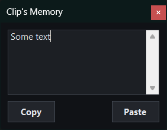

# Pet

Minimal desktop pet for Windows (C# / WinForms).

- Follows cursor
- Remembers clipboard text
- Lives in tray
- Wobbles

## Controls

| Action | Result |
|--------|--------|
| LMB | Push pet away from cursor |
| RMB | Open clipboard memory |
| MMB | Exit |

## Requirements

- Windows
- .NET 8 SDK (development only)
  `winget install Microsoft.DotNet.SDK.8`

## Run

`dotnet run`

## Build

`dotnet publish -c Release`

Output:
`bin/Release/net8.0-windows/win-x64/publish/`

## License

Free to modify.
