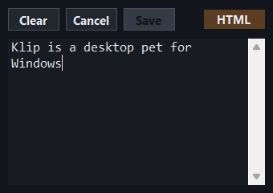

# Klip

Klip is a small desktop pet for Windows that follows your cursor and remembers your clipboard.

## Features

- Follows the cursor
- Shows clipboard text or images
- Lets you edit clipboard text (plain text only)
- Lives in the system tray
- Wobbles

## Usage

### Download

Prebuilt portable version available on [itch.io](https://tupinumboor.itch.io/klip)

### Controls

| Action | Result |
|--------|--------|
| LMB | Pushes the pet away from the cursor |
| RMB | Opens clipboard memory |
| MMB | Exits the app |

## Development

Klip is written in C# and WinForms

Requirements for building or modifying Klip:

- Windows
- .NET 8 SDK
  `winget install Microsoft.DotNet.SDK.8`

### Run

`dotnet run --project src/Klip`

### Build

`dotnet publish -c Release`

Output:

`src/Klip/bin/Release/net8.0-windows/win-x64/publish/`

## License

Free to modify.
